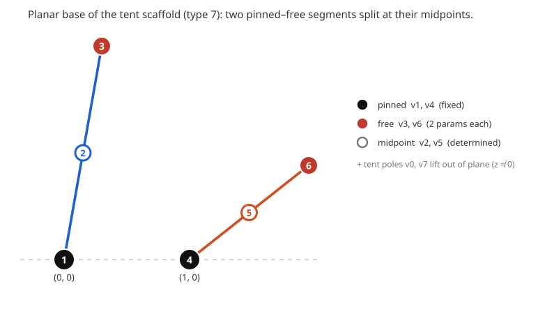

# The Doyle–Schwartz tent scaffold (`coordinates/dsScaffold`)

A reduced coordinate system for type-7 (Rich) paper tori: a 10-dimensional `ConfigSpace` whose configurations are, by construction, two coplanar "tent-pole" segments plus two lifted apex vertices. It is a strict *generalization* of the closed-form `doyleSchwartzPositions` family — the same combinatorial scaffold, with the Doyle–Schwartz symmetry dropped — built so that a search lives in the genuine degrees of freedom and so that perturbation stays in the model automatically.

This file documents the math and the triangulation choice. The implementation lives in `src/core/coordinates/dsScaffold.ts`; the search runner is `scripts/discover-ds.mjs`.

## Why this model

We want a family of flat, embedded, 8-vertex tori we can sample, perturb, and eventually drive onto a modulus boundary, while keeping the configuration honest at every step. Expressing the scaffold as constraints bolted onto the full space ℝ²⁴ would mean (a) carrying redundant degrees of freedom and (b) having to re-impose the structure after every perturbation. Instead we bake the scaffold into an immersion φ : ℝ¹⁰ → ℝ²⁴ and hand it to `makeConfigSpace` (the `symmetry.ts` / `pin.ts` pattern). Then:

- the search runs in 10 honest DOF;
- a Gaussian kick in ℝ¹⁰ never leaves the model (the "perturb must stay in-model" requirement is free);
- flatness is the only thing the solver must enforce on top.

## Triangulation choice: type 7 (Rich), `v8-7`

The scaffold is specific to the **degree-6-regular** 8-vertex triangulation of the torus — Rich Schwartz's vertex-minimal torus, id `v8-7` in `triangulations/eightVertex.ts`. The facts that make the role assignment well-posed:

- **All eight vertices have degree 6.** So the 1-skeleton is *not* complete (that would be degree 7): each vertex is non-adjacent to exactly one other. The skeleton is `K₈` minus a perfect matching, i.e. the cocktail-party graph **K₍₂,₂,₂,₂₎** (24 edges = E ✓). The four non-edges ("antipodal pairs") are
  $$\{0,4\},\quad\{1,5\},\quad\{2,6\},\quad\{3,7\}.$$
- **The triangulation is vertex-transitive**, with automorphism group of order **|Aut| = 32** (permutations of the 8 labels preserving the 16 faces). So no single vertex is special: *which* vertex is pinned is immaterial — only the relational role pattern matters, and all consistent patterns are carried onto one another by Aut.
- The role pattern is governed entirely by the antipodal matching. Each antipodal pair splits into one "structural" vertex (a pole or a midpoint) and one segment endpoint:

  | antipodal pair | structural | endpoint |
  |---|---|---|
  | {0,4} | 0 = pole | 4 |
  | {3,7} | 7 = pole | 3 |
  | {2,6} | 2 = midpoint | 6 |
  | {1,5} | 5 = midpoint | 1 |

  Equivalently: the structural set {0,2,5,7} and the endpoint set {1,3,4,6} are complementary transversals of the matching. Each segment {1,2,3}, {4,5,6} is a 3-clique (the "segment" 1–3 and 4–6 are themselves edges), and the pole pair {0,7} is an edge.

This is exactly the structure of the Doyle–Schwartz closed form, so at least one flat embedded torus provably lives in the model (see [Relation to `doyleSchwartzPositions`](#relation-to-doyleschwartzpositions)).

## Role assignment

Roles map to the DS vertex labels (the implementation takes a `roles` argument defaulting to these):

- **poles** `[0, 7]` — the two apex vertices, free in ℝ³;
- **segment 1** `{pin: 1, mid: 2, free: 3}`;
- **segment 2** `{pin: 4, mid: 5, free: 6}`.

So `A = v1`, `B = v4` are pinned; `C = v3`, `D = v6` are free in the plane; `E = v2`, `F = v5` are the segment midpoints.



The picture shows the six planar vertices (the two tent poles v0, v7 are omitted — they lift out of the z = 0 plane). The two pinned vertices sit on the dashed baseline at (0,0) and (1,0); each segment runs from a pinned vertex to a free vertex, with the midpoint vertex determined as its center. The two segments need not be parallel (the DS symmetry is broken) and may or may not cross — non-intersection is *not* enforced here; the embeddedness energy in the search takes care of it.

> Note on symmetry. Rich's ρ is the automorphism `(0 7)(1 6)(2 5)(3 4)`. With the default pins `A = 1, B = 4`, ρ maps the pinned vertices to the free ones, so a ρ-symmetric torus carries no manifest relation among the parameters. If a symmetric sub-model is ever wanted, pinning the ρ-pair `A = 3, B = 4` makes every role-pair ρ-conjugate (poles (0,7), midpoints (2,5), pinned (3,4), free (1,6)), and ρ then acts as "swap segment 1 ↔ segment 2." This is a one-line change to the `roles` default and does not affect the general model.

## The model φ : ℝ¹⁰ → ℝ²⁴

Parameter vector
$$\theta = [\,c_x, c_y,\; d_x, d_y,\; g_x, g_y, g_z,\; h_x, h_y, h_z\,].$$

The ambient configuration is `[x_v, y_v, z_v]` for v = 0..7 (flat layout, 24 floats). φ is **affine**:

| vertex | role | x | y | z |
|---|---|---|---|---|
| v1 | A — pin | 0 | 0 | 0 |
| v4 | B — pin | 1 | 0 | 0 |
| v3 | C — free | c_x | c_y | 0 |
| v6 | D — free | d_x | d_y | 0 |
| v2 | E — mid(A,C) | c_x / 2 | c_y / 2 | 0 |
| v5 | F — mid(B,D) | (1 + d_x)/2 | d_y / 2 | 0 |
| v0 | G — pole | g_x | g_y | g_z |
| v7 | H — pole | h_x | h_y | h_z |

Its Jacobian Dφ (constant, 24×10) has the linear part only: c_x → rows v3.x (1) and v2.x (½); c_y likewise into v3.y, v2.y; d_x, d_y into v6, v5; the six pole coordinates map identically into v0, v7. The pin/midpoint constants (v4.x = 1, the ½ in v5.x) do not appear in Dφ.

### Degrees of freedom and the flat locus

- **10 free parameters**: 2 (C) + 2 (D) + 3 (G) + 3 (H).
- **Gauge is fully fixed inside the model**: pinning v1 = (0,0,0) kills translation, v4 = (1,0,0) kills in-plane rotation and scale, and forcing the six base vertices to z = 0 kills rotation about the v1–v4 axis. The only residual symmetry is the discrete reflection z ↦ −z (which flips the two pole heights). Because the gauge is already fixed, **do not compose this space with `normalized.ts`** — that would double-fix it.
- The flatness constraint emits V − 1 = 7 independent rows (Gauss–Bonnet kills the eighth). So the flat locus inside ℝ¹⁰ is generically **3-dimensional** — a genuine family to discover and gate by embeddedness. (The `project` solver is min-norm Gauss–Newton, so the underdetermined 7-in-10 system is handled natively.)

### Pullback metric

Dφ has orthogonal columns, so the pullback metric g = DφᵀDφ is diagonal:
$$g = \mathrm{diag}\!\left(\tfrac54,\tfrac54,\tfrac54,\tfrac54,\;1,1,1,1,1,1\right),$$
the 5/4 on the c, d columns coming from the midpoint coupling (norm² = 1 + ¼). This is non-uniform, so it is *not* the identity the solver currently assumes (the solvers run g = I; see `configuration/README.md`). The anisotropy is mild and harmless — the search re-projects onto the flat locus every step — but if conditioning ever matters, reparametrizing a segment by its midpoint rebalances the columns.

### `coords` and the in-model perturbation guarantee

`coords` (the left inverse of φ) reads C, D, G, H straight off an ambient configuration (vertices v3, v6, v0, v7); the pins, midpoints, and z = 0 slots are ignored. On the image of φ this is exact (`coords ∘ φ = id`). This is what makes the perturb/reoptimize loop safe: even though results are stored as ambient 24-float CSV rows (so `certify`, `build-moduli-data`, and the viewers consume them unchanged), re-entering a row through `coords` snaps it back to θ ∈ ℝ¹⁰, and the Gaussian kick is applied there. Every perturbation is therefore in-model by construction.

## Relation to `doyleSchwartzPositions`

The closed-form DS torus (`search/doyleSchwartz.ts`, modulus τ = x + iy) has its six planar vertices in z = 0 forming two collinear triples with the middle vertex at the exact midpoint (the rows are arithmetic progressions: P2 = ½(P1+P3), P5 = ½(P4+P6)) and two tent poles at equal height related by ρ. That is exactly this scaffold *plus* the ρ-symmetry and a specific modulus. Dropping ρ and the height/segment relations leaves the 10-parameter model here, which therefore *contains* the entire DS family as the ρ-symmetric slice. A gauge-fixed DS torus lands on φ's image and is flat — this is asserted in the unit tests, and is the reason the model is non-empty.

## Using it in search

The foundational `discover` search takes an optional `space` (defaulting to `fullSpace`, which short-circuits to the ambient behavior). Pass `dsScaffold(RICH)` to run in this model:

```
seed θ ∈ ℝ¹⁰ → project([flat] pulled through φ) → minimize(overlap energy pulled through φ, gated embedded) → push to ℝ²⁴ → certify
```

**Seeding.** Two sources of θ seeds:
1. *cold* — random θ around a sensible base (poles lifted, C, D spread), landed on the flat locus by `project`;
2. *DS-anchored* — gauge-fix `doyleSchwartzPositions(x, y)` into the model frame (send P1 → 0, P4 → (1,0)) and read `coords`, to start near a known flat torus at a chosen modulus.

**Perturb / reoptimize.** Load a pool of ambient rows → `coords` → θ → Gaussian kick → re-run the discover step. In-model by the `coords` retraction above.

**Moduli enforcement (later).** Driving these tori onto a modulus boundary (the rectangular wall Re τ̂ = 0, or a fixed modulus such as the square torus i) is the same `modulusWall` / `fixedModulus` constraint pulled through φ and tracked by `marchModulus`. The march machinery is space-agnostic once the constraints are pulled, so this is mostly wiring on top of the model documented here.

## References

- Doyle–Schwartz [DS25], §2.2 eq. (2) — the closed-form flat type-7 torus this scaffold generalizes (see `search/doyleSchwartz.ts`).
- `triangulations/eightVertex.ts` — the `v8-7` triangle list.
- `configuration/space.ts`, `coordinates/symmetry.ts`, `coordinates/pin.ts` — the `ConfigSpace` machinery and sibling coordinate systems.
